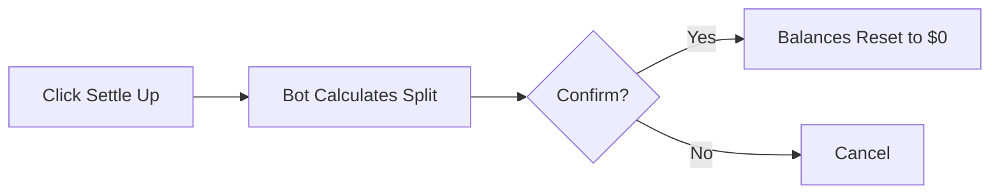

# 📘 Expense Bot: The Ultimate Guide

> **Quick Summary:** Your personal finance assistant for tracking expenses, splitting bills, and settling debts.

---

## ⚡ Cheatsheet (Top Commands)

| Action | Command/Example | Notes |
|--------|----------------|-------|
| Record Expense | `15 lunch` or `130 groceries` | Quick text entry - amount + description |
| Record from Receipt | Send photo(s) | AI extracts amount, merchant, category automatically |
| Check Balance | `/balance` | View current split and who owes what |
| View History | `/history` | View last 20 transactions |
| View Transaction | `/105` | Direct access by transaction ID |
| Settle Up | Button in menu | Reset all balances to $0 |
| Undo Entry | `Undo` Button | Available immediately after recording |
| Edit Transaction | `edit /15 20` or `@bot change amount to 20` | Two methods: command or natural language |
| View Dashboard | `/menu` or `/start` | Main hub with balance and recent activity |

---

## 📸 Recording Expenses

Here is how to track your expenses. You have two methods:

### Method A: Receipt Scanning (Recommended)

**How it works:**
1. Take a photo of your receipt (or screenshot from banking app)
2. Send it to the chat
3. **Wait:** The AI scans for Merchant, Items, Total, and Category
4. Transaction is automatically created and your balance updates

**Pro Tips:**
- You can send **multiple photos at once!** The bot waits 10 seconds to bundle them together
- Works with paper receipts, YouTrip screenshots, banking app screenshots, or any clear image showing transaction details
- You can send multiple parts of one long receipt, or multiple receipts from the same shopping trip

**What the AI extracts:**
- Total amount
- Merchant name
- Category (Food, Transport, Groceries, etc.)
- Individual items (if visible)
- Date

**Example confirmation:**
```
✅ Recorded 1 expense:
• Starbucks Coffee: SGD $12.50 (Food)

💰 Balance: Bryan owes Hwei Yeen $5.20
```

### Method B: Quick Text Input

**How it works:**
Type the amount followed by what it was for. The AI will parse it automatically.

**Pattern:** `amount description`

**Examples:**
- `12.50 uber home`
- `50 groceries`
- `130 lunch at restaurant`
- `25.99 coffee`

**What happens:**
1. AI parses the amount, category, and description
2. Transaction is created with default 70/30 split
3. You see a confirmation with an **Undo** button (available immediately)

**Example confirmation:**
```
✅ Recorded: groceries - $50.00 (Groceries)

💰 Balance: Hwei Yeen owes Bryan $15.00

💡 Tip: Tap 'Undo' if you made a mistake!
```

---

## ✂️ Editing & Corrections

Made a mistake? Just talk to the bot like a human. Here are two ways to fix it:

### Natural Language Editing (Easiest)

Tag the bot and tell it what to change:

**Examples:**
- `@bot split venchi 50-50` - Change split to 50/50
- `@bot change amount to 20` - Update the amount
- `@bot change category to Transport` - Change category
- `@bot change description to lunch` - Update description

**How it works:**
1. Tag the bot with `@bot` followed by your instruction
2. The AI understands your request and updates the most recent transaction
3. You see a diff view showing what changed

**Example response:**
```
✅ Updated /15

💵 Amount: $12.50 ➡️ $20.00
📝 Description: "coffee" ➡️ "lunch"
```

### Traditional Edit Commands

Use the `edit` command with transaction ID:

**Format:** `edit /<transaction_id> <new_value>`

**Examples:**
- `edit /15 20` - Change amount to $20
- `edit /15 lunch` - Change description to "lunch"
- `edit /15 Transport` - Change category to Transport

**All editable fields:**
- **Amount:** `edit /15 20` (changes to $20.00)
- **Description:** `edit /15 lunch` (changes description)
- **Category:** `edit /15 Transport` (changes category)
- **Split:** Use natural language: `@bot split 50-50`
- **Payer:** Use natural language: `@bot change payer to Bryan`
- **Date:** Use natural language: `@bot change date to 2024-01-15`
- **Time:** Use natural language: `@bot change time to 14:30`

**Pro Tip:** Natural language editing is usually faster and more intuitive!

---

## ⚖️ Review & Settle Up

### The Dashboard

The Dashboard is your main hub. Access it with `/menu` or `/start`.

**What it shows:**
- **Balance Header:** Who owes whom and how much (e.g., "Bryan owes Hwei Yeen $25.50")
- **Recent Activity:** Last 3 transactions with status indicators
  - 🔴 = Unsettled transaction
  - ✅ = Settled transaction
- **Quick Actions:** Buttons for Settle Up, History, and Menu

**Example Dashboard:**
```
📈 Scoreboard: Hwei Yeen is up by $25.50

📋 Latest Activity:
/105 🔴 15 Jan - Starbucks Coffee - $12.50 - Bryan
/104 ✅ 14 Jan - Groceries - $50.00 - Hwei Yeen
/103 🔴 13 Jan - Uber - $15.00 - Bryan

👇 Quick Record: Send a photo or type '5 Coffee'.
💡 Tip: Made a mistake? Type 'edit /15 20' to change amount...
```

### Settling Debts

**When to use:** End of month, end of trip, or whenever you want to clear the balance.

**The Flow:**



**Step-by-step:**
1. Click **💸 Settle Up** from the dashboard or menu
2. Bot shows you who owes whom and the amount
3. Review the calculation
4. Click **✅ Yes, Settle** to confirm, or **❌ Cancel** to abort
5. All unsettled transactions are marked as settled
6. Balance resets to $0.00
7. Dashboard refreshes automatically

**Understanding the 70/30 Split:**

All expenses are automatically split:
- **Bryan:** 70% of total expenses
- **Hwei Yeen:** 30% of total expenses

**Example calculation:**
- Bryan paid $100, Hwei Yeen paid $50
- Total spending: $150
- Bryan's share (70%): $105
- Hwei Yeen's share (30%): $45
- Since Bryan paid $100 but owes $105, **Bryan owes Hwei Yeen $5**

**Note:** You can change the split ratio for individual transactions using the edit commands described in the Editing section.

---

## 📜 History & Auditing

### Viewing Transaction History

**Quick access:**
- Type `/history` to see a list of transactions
- Click **📜 History** button from the dashboard

**What you see:**
- **List View:** Last 20 transactions in a compact format
- **Format:** `/<id> <status> *merchant* - $amount`
  - 🔴 = Unsettled transaction
  - ✅ = Settled transaction
- **Pagination:** Use the **⬇️ Load More** button to see older transactions (20 per page)

**Example history list:**
```
📜 Transaction History

/105 🔴 15 Jan - Starbucks Coffee - $12.50 - Bryan
/104 ✅ 14 Jan - Groceries - $50.00 - Hwei Yeen
/103 🔴 13 Jan - Uber - $15.00 - Bryan
/102 ✅ 12 Jan - Lunch - $30.00 - Bryan
...
```

**Sorting:** Transactions are sorted by when they were recorded (most recent first), not by transaction date.

### Viewing Transaction Details

**How to view details:**
1. Click on any transaction ID (e.g., `/105`) from the history list
2. Or type the ID directly: `/105`

**What you see:**
- Full transaction details card showing:
  - Date and time
  - Merchant/Description
  - Amount
  - Category
  - Payer
  - Split information
  - Status (settled/unsettled)

**Action buttons available:**
- **✅ Settle** - Mark this transaction as settled (only if unsettled)
- **✨ AI Edit** - Edit using natural language
- **🗑️ Delete** - Remove this transaction
- **« Back** - Return to history list

**Example detail card:**
```
📋 Transaction /105

📅 Date: 15 Jan 2024, 14:30
🏪 Merchant: Starbucks Coffee
💵 Amount: SGD $12.50
📂 Category: Food
👤 Paid by: Bryan
📊 Split: 70% Bryan, 30% Hwei Yeen
🔴 Status: Unsettled
```

---

## ❓ FAQ & Troubleshooting

### Common Issues

**Q: The bot didn't reply to my photo.**
- Check your internet connection
- Wait 30 seconds - AI processing can take time
- If no reply after 30s, try sending the photo again
- Make sure the photo is clear and shows transaction details

**Q: I entered the wrong amount.**
- **Quick fix:** Use the **Undo** button immediately after recording (available for a few seconds)
- **After Undo expires:** Use `edit /<id> <correct_amount>` or `@bot change amount to <correct_amount>`

**Q: How do I change the split ratio?**
- Use natural language: `@bot split 50-50` or `@bot split this 60-40`
- The bot will update the most recent transaction by default
- To edit a specific transaction, first view it with `/105`, then use the **✨ AI Edit** button

**Q: Can I delete a transaction?**
- Yes! View the transaction detail (click the ID), then click **🗑️ Delete**
- Or use natural language: `@bot delete this` (for most recent transaction)

**Q: The bot didn't understand my edit command.**
- Make sure you're tagging the bot: `@bot <your instruction>`
- Be specific: "change amount to 20" is better than "fix it"
- Try the traditional format: `edit /15 20`

**Q: How do I see who owes what?**
- Use `/balance` command
- Or click **💸 Settle Up** to see the detailed breakdown
- The dashboard also shows a summary at the top

**Q: Can I send multiple receipts at once?**
- Yes! Send all photos within 10 seconds
- The bot will collect them and process as a batch
- Each receipt becomes a separate transaction

**Q: What if I want to record an expense manually?**
- Use quick text: `50 groceries` (fastest)
- Or use the menu: Click **☰ Menu** → **➕ Add Manual Expense** (step-by-step wizard)

**Q: How do I view older transactions?**
- Use `/history` and click **⬇️ Load More** to see older entries
- Transactions are paginated (20 per page)

**Q: What categories are available?**
- Food, Transport, Groceries, Shopping, Bills, Entertainment, Medical, Travel, Other
- The AI usually picks the right category automatically
- You can change it using edit commands

---

## 🎯 Quick Tips

1. **Record expenses immediately** after making a purchase to avoid forgetting
2. **Use photos when possible** - it's faster and more accurate than typing
3. **Settle up regularly** (e.g., weekly or monthly) to keep balances manageable
4. **Use natural language editing** - it's more intuitive than remembering command syntax
5. **Check the dashboard regularly** to stay on top of who owes what

---

**Happy tracking!** 🎉
